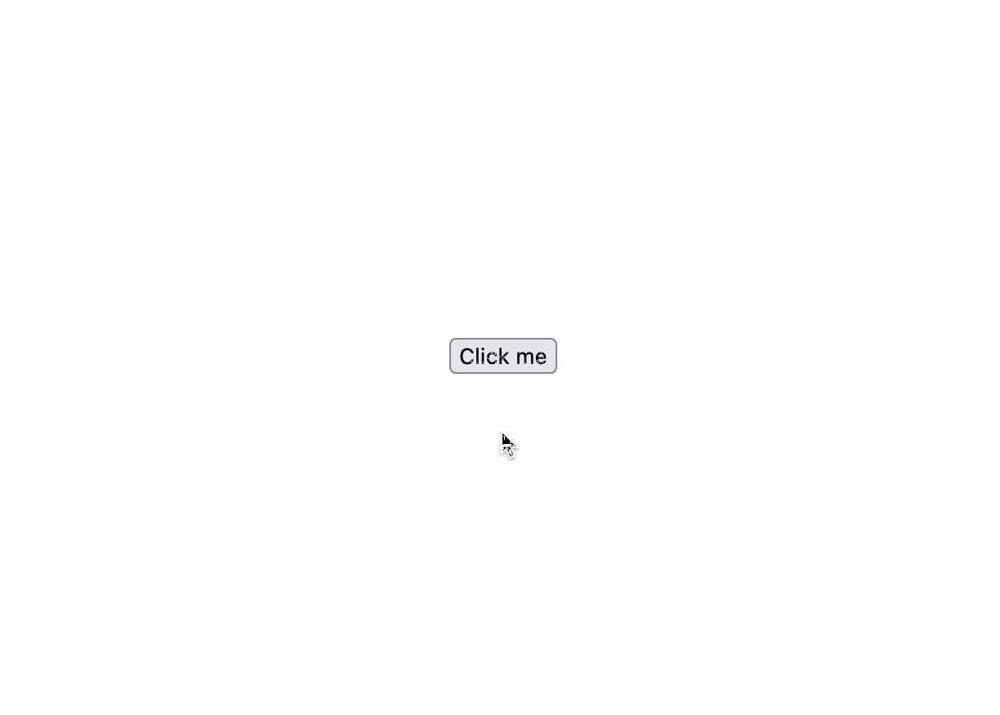
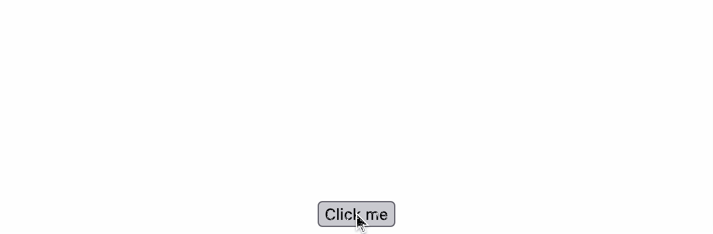
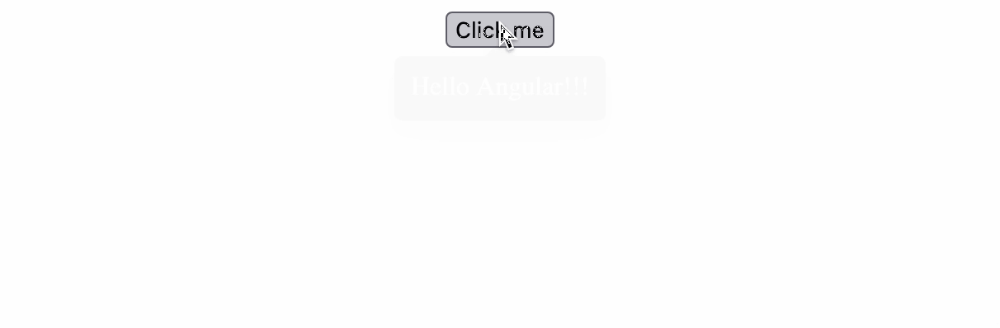
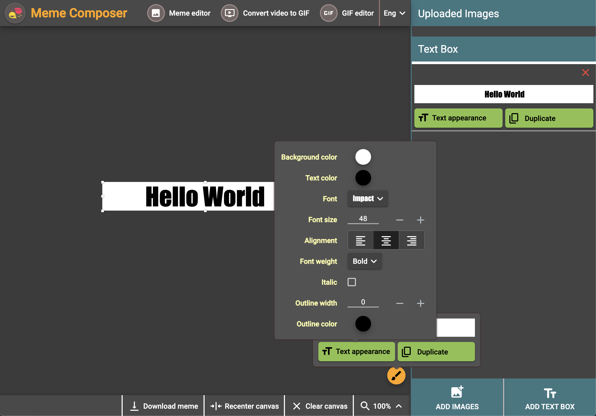

# angular-anchored-floating-box [](https://app.circleci.com/pipelines/github/lazycuh/angular-anchored-floating-box?branch=main)

An easy, declarative way to render a floating box with arbitrary content anchored to an element.

## Table of contents

<!-- toc -->

- [Angular compatibility](#angular-compatibility)
- [Installation](#installation)
- [Available APIs](#available-apis)
  - [`TriggerFloatingBoxForDirective`](#triggerfloatingboxfordirective)
    - [Inputs](#inputs)
  - [`AnchoredFloatingBox`](#anchoredfloatingbox)
    - [Inputs](#inputs-1)
    - [Outputs](#outputs)
    - [Methods](#methods)
  - [Example:](#example)
  - [Result](#result)
- [Real world example](#real-world-example)

<!-- tocstop -->

## Angular compatibility

| This library | Angular |
| ------------ | ------- |
| 4.x.x        | 20.x.x  |
| 3.x.x        | 19.x.x  |
| 2.x.x        | 19.x.x  |
| 1.x.x        | 16 - 18 |

## Installation

- `npm`
  ```
  npm i -S @lazycuh/angular-anchored-floating-box
  ```
- `pnpm`
  ```
  pnpm i -S @lazycuh/angular-anchored-floating-box
  ```
- `yarn`
  ```
  yarn add @lazycuh/angular-anchored-floating-box
  ```

## Available APIs

These are the symbols that are available from this package

### `TriggerFloatingBoxForDirective`

#### Inputs

| Name                      | Type                  | Description                                                                                                                                                                                                                          |
| ------------------------- | --------------------- | ------------------------------------------------------------------------------------------------------------------------------------------------------------------------------------------------------------------------------------ |
| `lcTriggerFloatingBoxFor` | `AnchoredFloatingBox` | **Required** input that accepts a template reference variable to a `AnchoredFloatingBox` component that specifies the content of the floating box, the floating box is anchored to the `HTMLElement` to which this input is applied. |

### `AnchoredFloatingBox`

#### Inputs

| Name    | Type              | Description                              |
| ------- | ----------------- | ---------------------------------------- |
| `class` | `string`          | **Optional** CSS class attribute to add. |
| `theme` | `light` \| `dark` | **Optional** theme. Default is `light`.  |

#### Outputs

| Name           | Type         | Description                               |
| -------------- | ------------ | ----------------------------------------- |
| `closed`       | `() => void` | Called after the floating box is closed.  |
| `beforeOpened` | `() => void` | Called before the floating box is opened. |
| `opened`       | `() => void` | Called after the floating box is opened.  |

#### Methods

- `AnchoredFloatingBox.setDefaultTheme(theme)`: Set the default theme that will be used for all future floating boxes. Use this method if you want to set the theme once instead of each time you render the floating box.

### Example:

```ts
@Component({
  changeDetection: ChangeDetectionStrategy.OnPush,
  selector: 'lc-test',
  // Import the directive and the component to use it
  imports: [TriggerFloatingBoxForDirective, AnchoredFloatingBox],
  template: `
    <button
      id="click-me"
      [lcTriggerFloatingBoxFor]="floatingBoxTemplateRefVar"
      type="button">
      Click me
    </button>

    <lc-anchored-floating-box
      #floatingBoxTemplateRefVar
      class="test-example"
      theme="dark">
      Hello Angular!!!</span>
    </ng-template>
  `
})
class MyComponent {}
```

### Result

- Light theme
  

- Dark theme
  

<br/>

It will also reposition itself if it overflows the top or bottom edge of the viewport like so.



<br/>

<br/>

## Real world example

Below is a screenshot of a personal app of mine at [https://memecomposer.com](https://memecomposer.com) that uses this component. Clicking on the brush icon button popped open an anchored floating box, then clicking "Text appearance" button inside of it opened another anchored floating box that is independent of the previous one and any others.


